<figure markdown>
[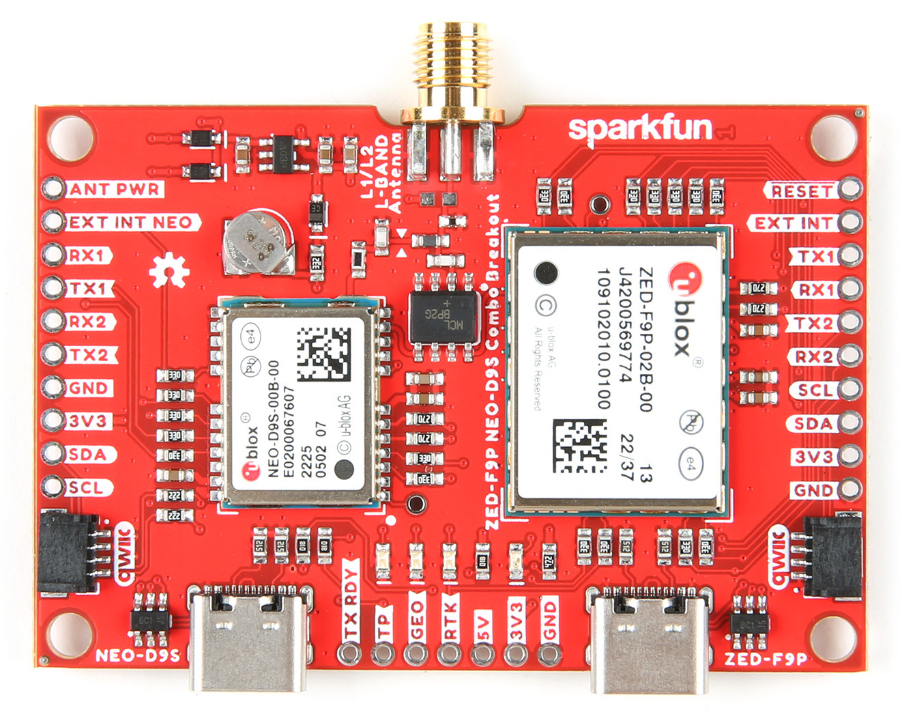{ width="600" }](assets/imgs/22560-SparkFun_u-blox_ZED-F9P_NEO-D9S_Combo-Top.jpg "Click to enlarge")
<figcaption markdown>
The Combo Breakout PCB.
</figcaption>
</figure>

The u-blox ZED-F9P NEO-D9S Combo Breakout is a sophisticated yet compact GNSS board. The following is a summary of its features and functions:

* **`ZED-F9P`** - the ZED-F9P is a top-of-the-line module for high accuracy GNSS and GPS location solutions
    * Concurrent reception of GPS, GLONASS, Galileo and BeiDou
    * Multi-band RTK with fast convergence times and reliable performance
    * Centimeter-level accuracy in a small and energy-efficient module

<figure markdown>
[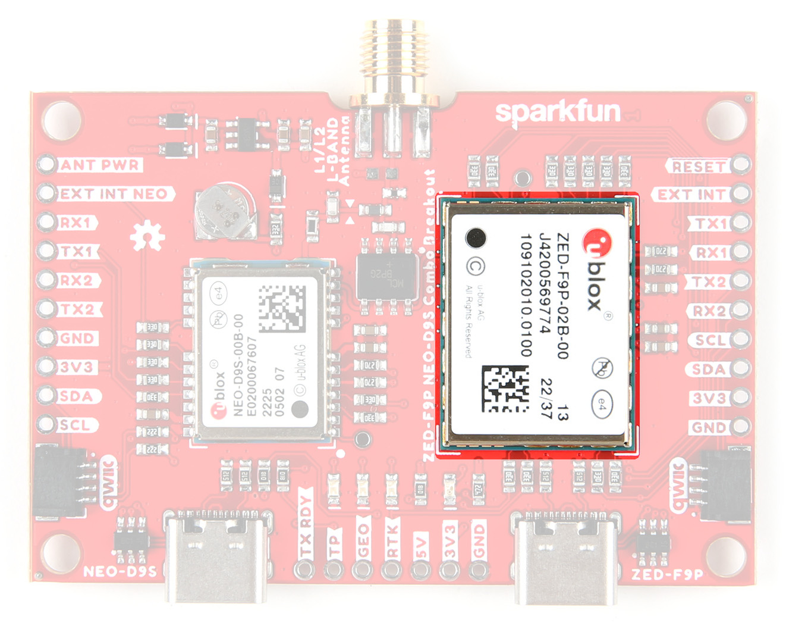{ width="600" }](assets/imgs/22560-SparkFun_u-blox_ZED-F9P_NEO-D9S_Combo-ZED-F9P.jpg "Click to enlarge")
<figcaption markdown>
The ZED-F9P GNSS module.
</figcaption>
</figure>

* **`NEO-D9S`** - the NEO-D9S is a satellite data receiver for L-band correction broadcast
    * The NEO-D9S can be configured for use with a variety of L-band correction services including u-blox's PointPerfect service
    * It decodes the satellite transmission and outputs a correction stream directly to the ZED-F9P via UART2

<figure markdown>
[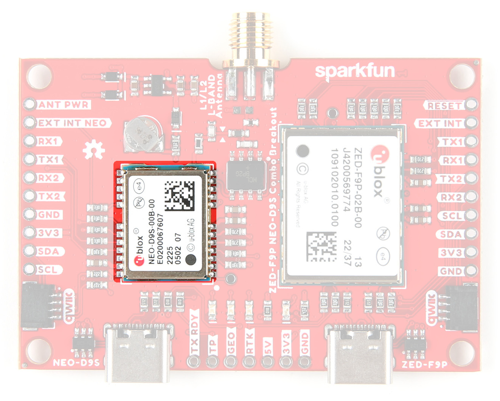{ width="600" }](assets/imgs/22560-SparkFun_u-blox_ZED-F9P_NEO-D9S_Combo-NeoD9S.jpg "Click to enlarge")
<figcaption markdown>
The NEO-D9S correction data receiver.
</figcaption>
</figure>

* **`UART2 TX and RX`** - the ZED-F9P and NEO-D9S UART2 TX and RX are interconnected (crossed-over) to allow the NEO to feed corrections directly to the ZED
    * The UART2 pins can be isolated if required by opening the **TX2** and **RX2** jumpers
    * Using UART2 to pass the correction data is recommended, but is optional. You can use UART1 or I2C instead if you want to. Our u-blox Arduino Library has an [example](https://github.com/sparkfun/SparkFun_u-blox_GNSS_v3/tree/main/examples/NEO-D9S_and_NEO-D9C/Example2_LBand_Corrections_with_NEO-D9S) which shows how to read the correction data from the NEO-D9S and push it to the ZED-F9P using I2C.

<figure markdown>
[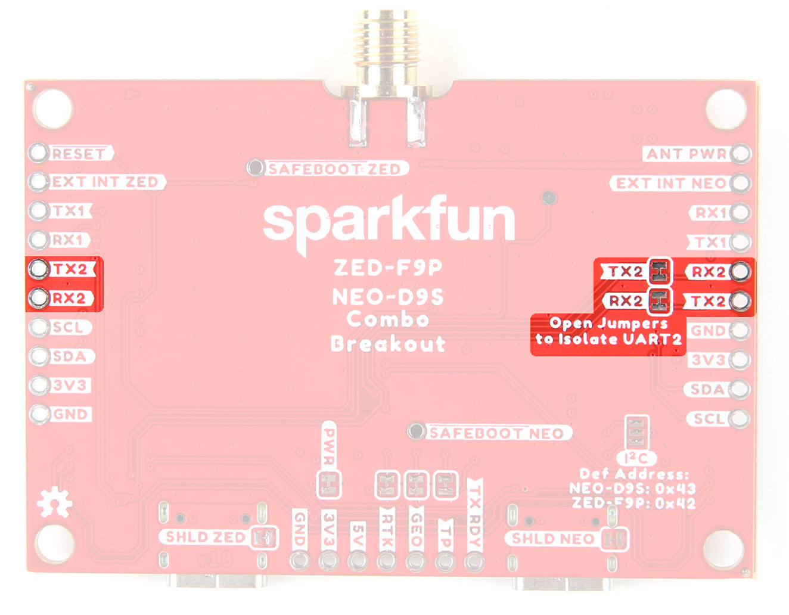{ width="600" }](assets/imgs/22560-SparkFun_u-blox_ZED-F9P_NEO-D9S_Combo-UART2.jpg "Click to enlarge")
<figcaption markdown>
The UART2 connections.
</figcaption>
</figure>

* **`Antenna Power Divider`** - the breakout has an on-board power divider (antenna splitter) to divide the satellite signals between the ZED and the NEO
    * The connector is SMA female (standard polarity)
    * 3.3V power is provided for an active antenna

<figure markdown>
[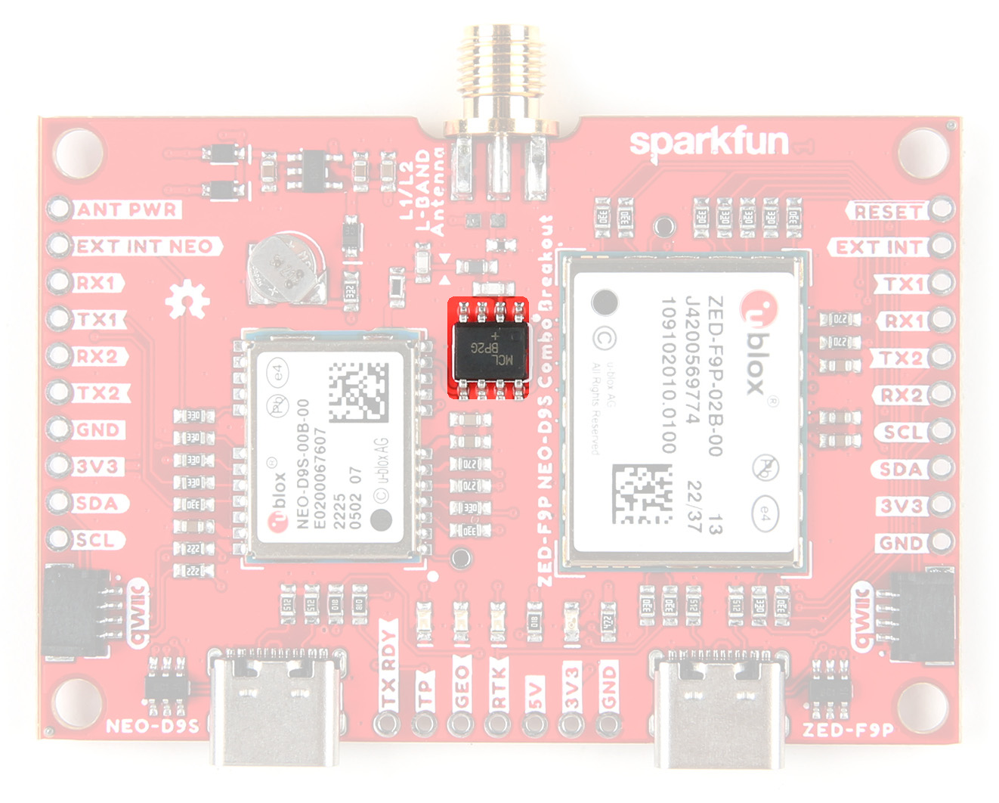{ width="600" }](assets/imgs/22560-SparkFun_u-blox_ZED-F9P_NEO-D9S_Combo-Splitter.jpg "Click to enlarge")
<figcaption markdown>
The antenna splitter (power divider).
</figcaption>
</figure>

* **`Dual USB-C connections`** - one USB-C connector provides a direct connection to the ZED-F9P; the second provides a direct connection to the NEO-D9S
    * The board can be powered via either USB-C connector, or both
    * There is no on-board USB hub. Both ports can be connected simultaneously to the same computer, or different computers if desired

<figure markdown>
[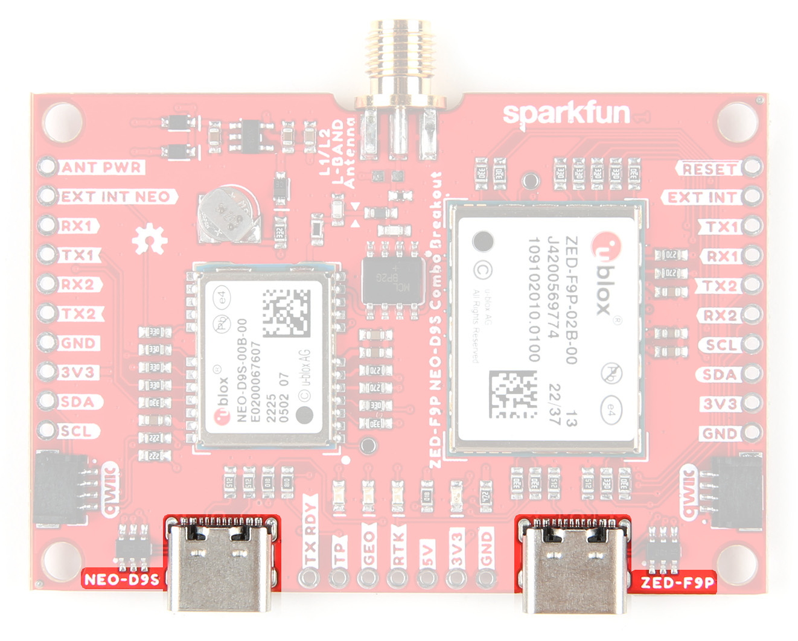{ width="600" }](assets/imgs/22560-SparkFun_u-blox_ZED-F9P_NEO-D9S_Combo-USB-C.jpg "Click to enlarge")
<figcaption markdown>
The two USB-C connectors.
</figcaption>
</figure>

* **`LED Indicators`** - the breakout has four LED indicators:
    * **3V3** Power
    * **RTK**: Off = No Carrier Solution; Flashing = Floating Solution; On = Fixed Solution
    * **GEO**: Geofence indication
    * **TP**: Timing Pulse (Pulse Per Second)
    * Each LED can be disabled by opening the corresponding split pad jumper on the bottom of the breakout

<figure markdown>
[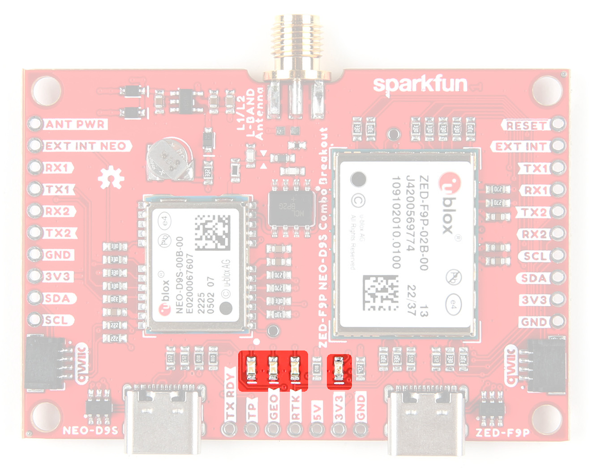{ width="600" }](assets/imgs/22560-SparkFun_u-blox_ZED-F9P_NEO-D9S_Combo-LEDs.jpg "Click to enlarge")
<figcaption markdown>
The LEDs.
</figcaption>
</figure>

* **`Dual Qwiic Connectors`** - the breakout has two Qwiic (I2C) connectors allowing the breakout to be daisy-chained into your Qwiic project

<figure markdown>
[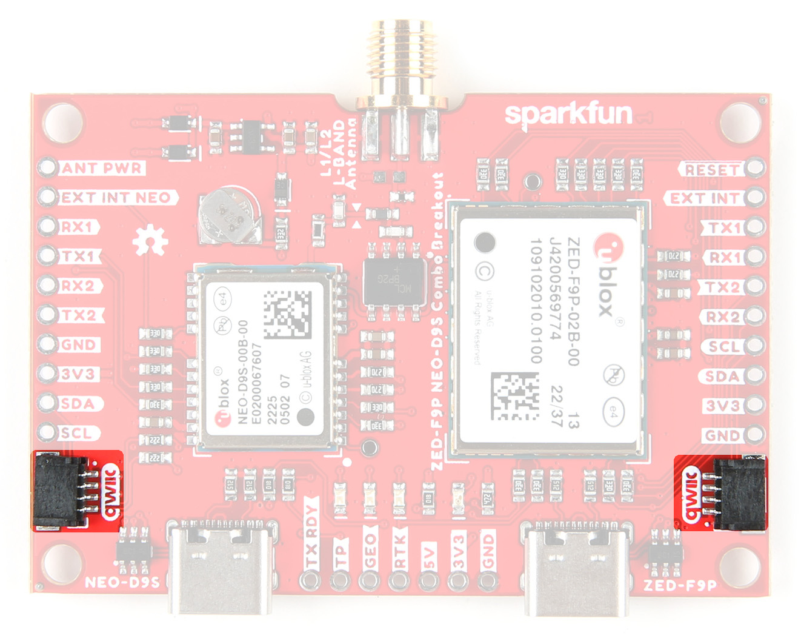{ width="600" }](assets/imgs/22560-SparkFun_u-blox_ZED-F9P_NEO-D9S_Combo-Qwiic.jpg "Click to enlarge")
<figcaption markdown>
The two Qwiic connectors.
</figcaption>
</figure>

* **`Back-up Battery`** - a small rechargeable coin cell maintains the ZED-F9P battery-backed RAM while the power is disconnected

<figure markdown>
[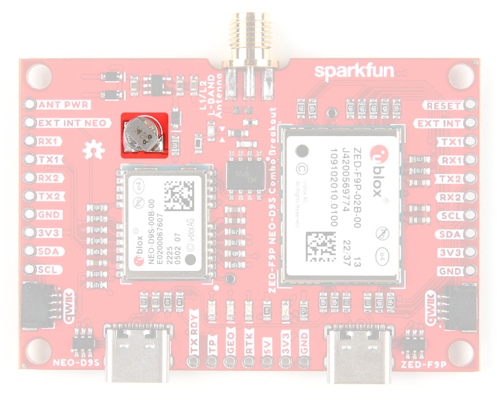{ width="600" }](assets/imgs/22560-SparkFun_u-blox_ZED-F9P_NEO-D9S_Combo-Battery.jpg "Click to enlarge")
<figcaption markdown>
The rechargeable back-up battery.
</figcaption>
</figure>

* **`Full set of breakout pads`** - the breakout pads provide full access to the ZED-F9P and NEO-D9S pins 
    * I2C
    * UART1
    * UART2
    * External Interrupt
    * Reset
    * Safeboot
    * ZED-F9P: TX_RDY, TP, GEO, RTK
    * Power: 5V and 3.3V

<figure markdown>
[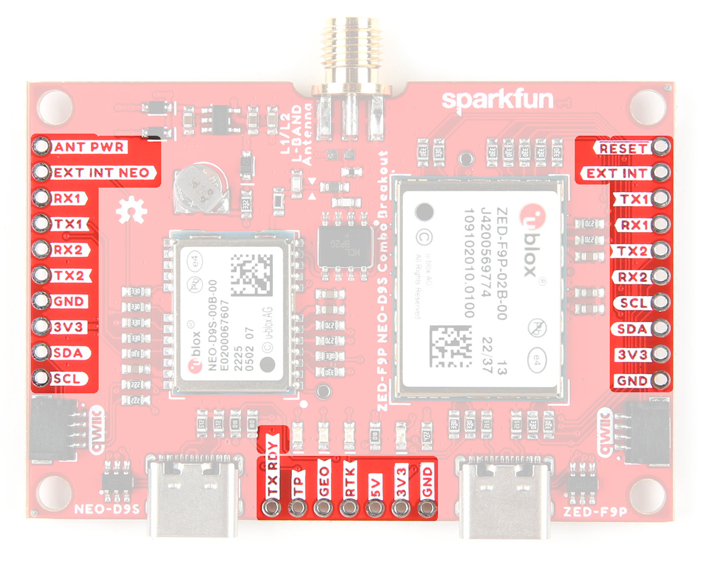{ width="600" }](assets/imgs/22560-SparkFun_u-blox_ZED-F9P_NEO-D9S_Combo-Pads.jpg "Click to enlarge")
<figcaption markdown>
The breakout pads.
</figcaption>
</figure>

## Board Dimensions

The board dimensions are illustrated in the drawing below. The listed measurements are in inches. The four mounting holes are compatible with 4-40 UNC or M3.0 screws.

<figure markdown>
[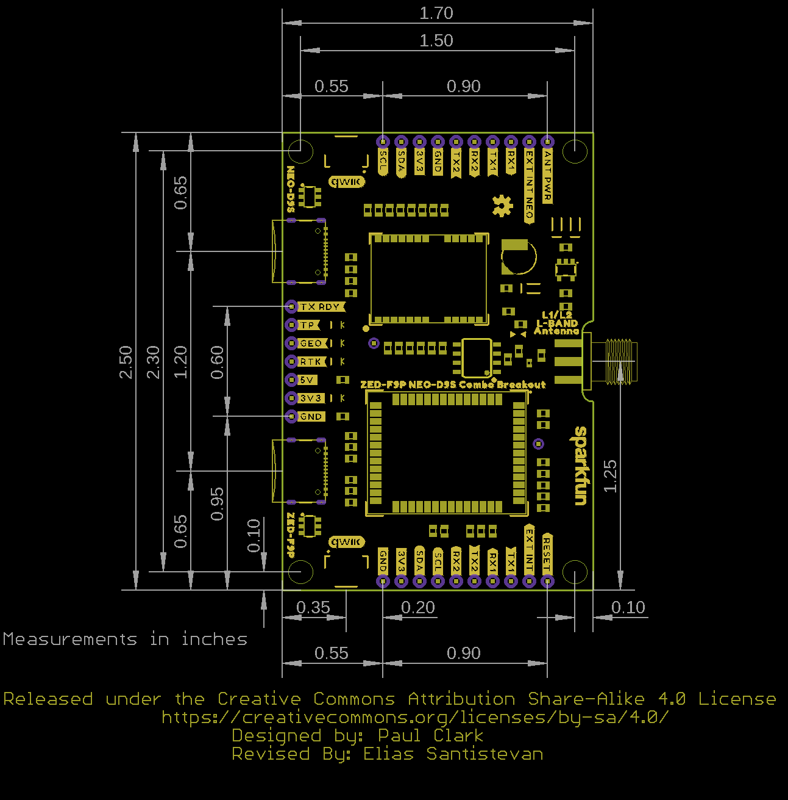{ width="600" }](assets/board_files/SparkFun_GNSS_Combo_Breakout-ZED-F9P_NEO-D9S_Dimensions.png "Click to enlarge")
<figcaption markdown>
Board dimensions.
</figcaption>
</figure>

## Left Edge Breakout Pads

With the SMA connector oriented to the 'top', the breakout pads down the left side of the board are:

<table style="font-size:12.25px; width:100%">
    <tr>
        <th style="text-align:center; vertical-align:middle; min-width:1rem;" width="20.0%">
            Pad
        </th>
        <th style="text-align:center; vertical-align:middle; min-width:4rem;" width="80.0%">
            Function
        </th>
    </tr>
    <tr>
        <td style="vertical-align:middle" align="center"><b>ANT_PWR</b></td>
        <td style="vertical-align:middle" align="center">External antenna power Cut the <b>ANT_VCC</b> trace and install L1 to enable</td>
    </tr>
    <tr>
        <td style="vertical-align:middle" align="center"><b>EXT_INT_NEO</b></td>
        <td style="vertical-align:middle" align="center">Connected to the NEO-D9S EXT_INT pin</td>
    </tr>
    <tr>
        <td style="vertical-align:middle" align="center"><b>RX1</b></td>
        <td style="vertical-align:middle" align="center">NEO-D9S UART1 RX Pin</td>
    </tr>
    <tr>
        <td style="vertical-align:middle" align="center"><b>TX1</b></td>
        <td style="vertical-align:middle" align="center">NEO-D9S UART1 TX Pin</td>
    </tr>
    <tr>
        <td style="vertical-align:middle" align="center"><b>RX2</b></td>
        <td style="vertical-align:middle" align="center">NEO-D9S UART2 RX Pin Connected to ZED-F9P TX2 (Open the <b>TX2</b> jumper to isolate)</td>
    </tr>
    <tr>
        <td style="vertical-align:middle" align="center"><b>TX2</b></td>
        <td style="vertical-align:middle" align="center">NEO-D9S UART2 TX Pin Connected to ZED-F9P RX2 (Open the <b>RX2</b> jumper to isolate)</td>
    </tr>
    <tr>
        <td style="vertical-align:middle" align="center"><b>GND</b></td>
        <td style="vertical-align:middle" align="center">Power Ground (0V)</td>
    </tr>
    <tr>
        <td style="vertical-align:middle" align="center"><b>3V3</b></td>
        <td style="vertical-align:middle" align="center">3.3V Supply rail Output of regulator U2 (Can also be used as a power input)</td>
    </tr>
    <tr>
        <td style="vertical-align:middle" align="center"><b>SDA</b></td>
        <td style="vertical-align:middle" align="center">I2C Data Common to both ZED and NEO</td>
    </tr>
    <tr>
        <td style="vertical-align:middle" align="center"><b>SCL</b></td>
        <td style="vertical-align:middle" align="center">I2C Clock Common to both ZED and NEO</td>
    </tr>
</table>

*For more details, users can reference the [schematic](assets/board_files/SparkFun_GNSS_Combo_Breakout-ZED-F9P_NEO-D9S_Schematic.pdf).*

## Right Edge Breakout Pads

With the SMA connector oriented to the 'top', the breakout pads down the right side of the board are:

<table style="font-size:12.25px; width:100%">
    <tr>
        <th style="text-align:center; vertical-align:middle; min-width:1rem;" width="20.0%">
            Pad
        </th>
        <th style="text-align:center; vertical-align:middle; min-width:4rem;" width="80.0%">
            Function
        </th>
    </tr>
    <tr>
        <td style="vertical-align:middle" align="center"><b>RESET</b></td>
        <td style="vertical-align:middle" align="center">Reset Active low. Common to both ZED and NEO</td>
    </tr>
    <tr>
        <td style="vertical-align:middle" align="center"><b>EXT_INT</b></td>
        <td style="vertical-align:middle" align="center">Connected to the ZED-F9P EXT_INT pin</td>
    </tr>
    <tr>
        <td style="vertical-align:middle" align="center"><b>TX1</b></td>
        <td style="vertical-align:middle" align="center">ZED-F9P UART1 TX Pin</td>
    </tr>
    <tr>
        <td style="vertical-align:middle" align="center"><b>RX1</b></td>
        <td style="vertical-align:middle" align="center">ZED-F9P UART1 RX Pin</td>
    </tr>
    <tr>
        <td style="vertical-align:middle" align="center"><b>TX2</b></td>
        <td style="vertical-align:middle" align="center">ZED-F9P UART2 TX Pin Connected to NEO-D9S RX2 (Open the <b>TX2</b> jumper to isolate)</td>
    </tr>
    <tr>
        <td style="vertical-align:middle" align="center"><b>RX2</b></td>
        <td style="vertical-align:middle" align="center">ZED-F9P UART2 RX Pin Connected to NEO-D9S TX2 (Open the <b>RX2</b> jumper to isolate)</td>
    </tr>
    <tr>
        <td style="vertical-align:middle" align="center"><b>SCL</b></td>
        <td style="vertical-align:middle" align="center">I2C Clock Common to both ZED and NEO</td>
    </tr>
    <tr>
        <td style="vertical-align:middle" align="center"><b>SDA</b></td>
        <td style="vertical-align:middle" align="center">I2C Data Common to both ZED and NEO</td>
    </tr>
    <tr>
        <td style="vertical-align:middle" align="center"><b>3V3</b></td>
        <td style="vertical-align:middle" align="center">3.3V Supply rail Output of regulator U2 (Can be used as a power input)</td>
    </tr>
    <tr>
        <td style="vertical-align:middle" align="center"><b>GND</b></td>
        <td style="vertical-align:middle" align="center">Power Ground (0V)</td>
    </tr>
</table>

*For more details, users can reference the [schematic](assets/board_files/SparkFun_GNSS_Combo_Breakout-ZED-F9P_NEO-D9S_Schematic.pdf).*

## Right Edge Breakout Pads

With the SMA connector oriented to the 'top', the breakout pads along the bottom edge of the board are:

<table style="font-size:12.25px; width:100%">
    <tr>
        <th style="text-align:center; vertical-align:middle; min-width:1rem;" width="20.0%">
            Pad
        </th>
        <th style="text-align:center; vertical-align:middle; min-width:4rem;" width="80.0%">
            Function
        </th>
    </tr>
    <tr>
        <td style="vertical-align:middle" align="center"><b>TX_RDY</b></td>
        <td style="vertical-align:middle" align="center">Indicates the ZED-F9P has data waiting in its I2C TX buffer</td>
    </tr>
    <tr>
        <td style="vertical-align:middle" align="center"><b>TP</b></td>
        <td style="vertical-align:middle" align="center">ZED-F9P Timing Pulse (Pulse Per Second)</td>
    </tr>
    <tr>
        <td style="vertical-align:middle" align="center"><b>GEO</b></td>
        <td style="vertical-align:middle" align="center">ZED-F9P Geofence indicator</td>
    </tr>
    <tr>
        <td style="vertical-align:middle" align="center"><b>RTK</b></td>
        <td style="vertical-align:middle" align="center">ZED-F9P RTK indication High = No Carrier Solution. Square Wave = Floating Solution. Low = Fixed Solution</td>
    </tr>
    <tr>
        <td style="vertical-align:middle" align="center"><b>5V</b></td>
        <td style="vertical-align:middle" align="center">5V Power Rail Can be used as a power input or output (from USB) (Diode protected)</td>
    </tr>
    <tr>
        <td style="vertical-align:middle" align="center"><b>3V3</b></td>
        <td style="vertical-align:middle" align="center">3.3V Supply rail Output of regulator U2 (Can be used as a power input)</td>
    </tr>
    <tr>
        <td style="vertical-align:middle" align="center"><b>GND</b></td>
        <td style="vertical-align:middle" align="center">Power Ground (0V)</td>
    </tr>
</table>

*For more details, users can reference the [schematic](assets/board_files/SparkFun_GNSS_Combo_Breakout-ZED-F9P_NEO-D9S_Schematic.pdf).*

## Jumpers

!!! note
    
Never modified a jumper before? Check out our <a href="https://learn.sparkfun.com/tutorials/664">Jumper Pads and PCB Traces tutorial</a> for a quick introduction!

    

        <a href="https://learn.sparkfun.com/tutorials/664">How to Work with Jumper Pads and PCB Traces 
        </a>
    

There are multiple jumpers on the back of the board that can be used to modify how the board functions.

<figure markdown>
[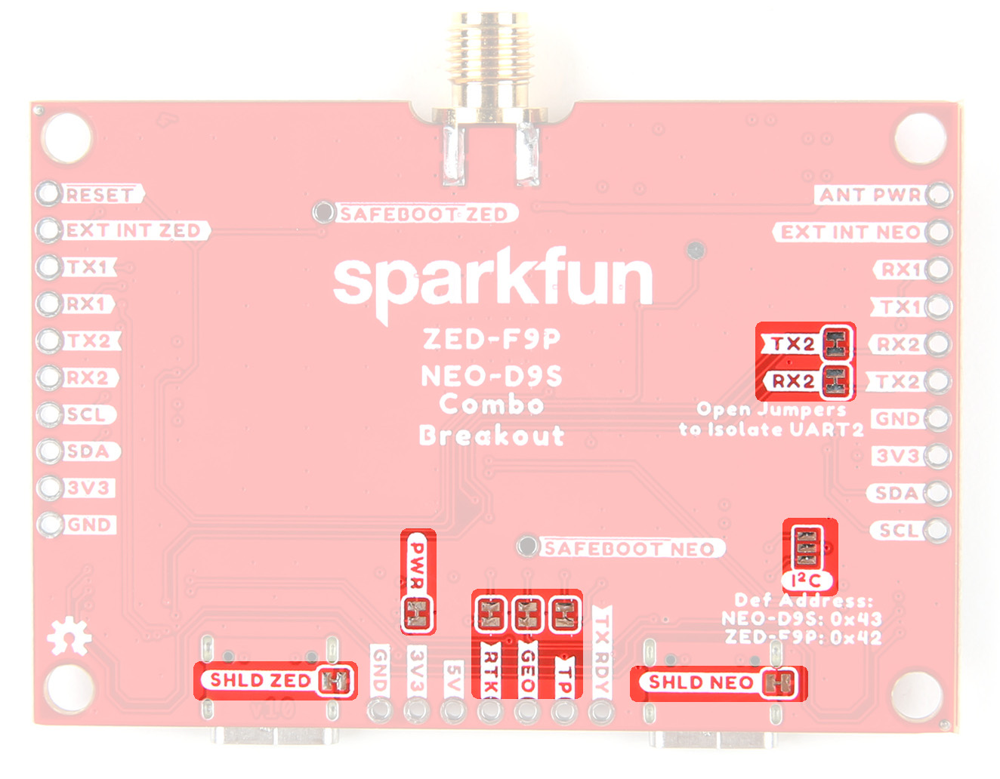{ width="600" }](assets/imgs/22560-SparkFun_u-blox_ZED-F9P_NEO-D9S_Combo-Jumpers.jpg "Click to enlarge")
<figcaption markdown>
The jumpers on the back of the board.
</figcaption>
</figure>

* **TX2** - open this jumper to isolate NEO-D9S RX2 from ZED-F9P TX2
* **RX2** - open this jumper to isolate NEO-D9S TX2 from ZED-F9P RX2
    * By default, the NEO-D9S PMP (SPARTN) correction data stream is output directly from NEO-D9S TX2 to the ZED-F9P RX2
    * Opening this jumper will break that connection
    * Correction data can be read from the NEO-D9S and pushed to the ZED-F9P via I2C instead
* **I2C** - close this double jumper to connect additional pull-up resistors to I2C **SCL** and **SDA**. Not recommended
* **SHLD** - the two **SHLD** jumpers can be opened to isolate the USB-C connector shields from **GND**. Not recommended, but may help prevent EMI
* **PWR** - open this jumper to disable the Power LED
* **RTK** - open this jumper to disable the RTK LED
* **GEO** - open this jumper to disable the GEO LED
* **TP** - open this jumper to disable the TP (PPS) LED

## ANT PWR

By default, 3.3V active antenna power is provided on the SMA connector via the NEO-D9S **VCC_RF** output pin.
Power is delivered via a 10 Ohm resistor, to limit the current in case the antenna cable becomes shorted.

If your antenna requires a higher voltage (or current):

* Isolate **VCC_RF** by cutting the trace marked by the arrow symbols on the top of the PCB

<figure markdown>
[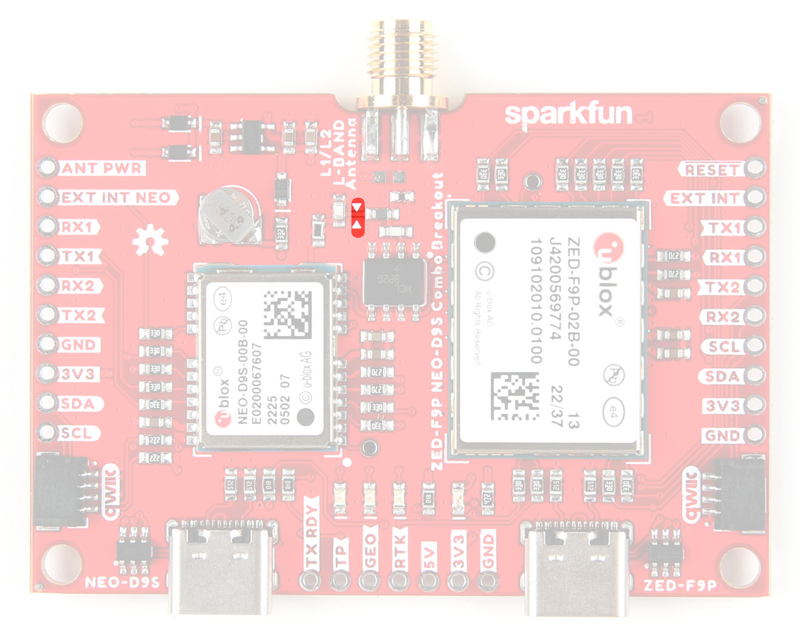{ width="600" }](assets/imgs/22560-SparkFun_u-blox_ZED-F9P_NEO-D9S_Combo-VCC-RF.jpg "Click to enlarge")
<figcaption markdown>
The VCC_RF trace.
</figcaption>
</figure>

* Install inductor L1 - using a 0603 inductor with impedance >500 Ohms at 1.5 GHz

<figure markdown>
[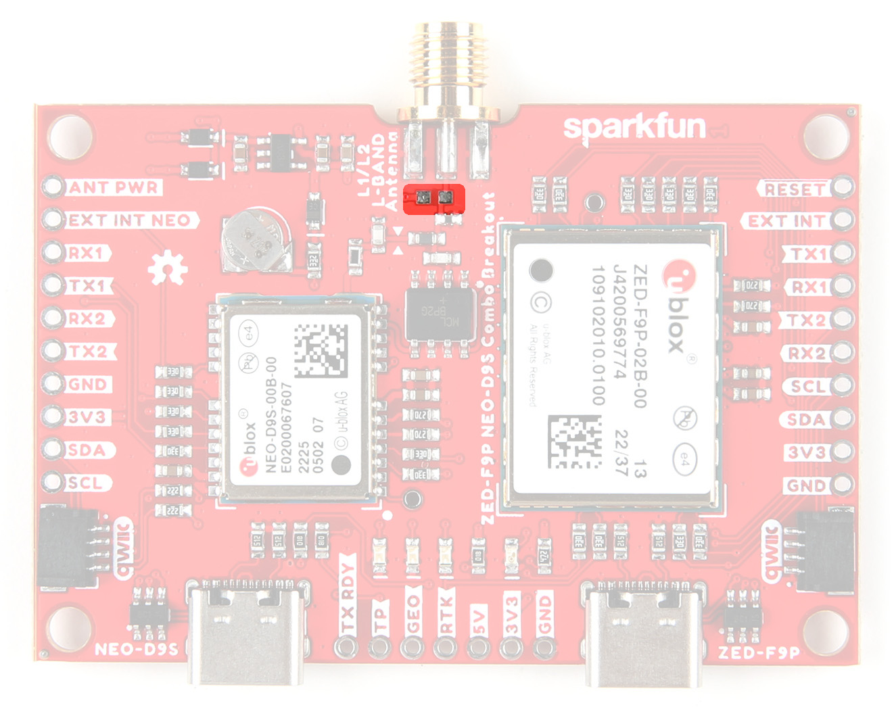{ width="600" }](assets/imgs/22560-SparkFun_u-blox_ZED-F9P_NEO-D9S_Combo-L1.jpg "Click to enlarge")
<figcaption markdown>
The position of L1.
</figcaption>
</figure>

* Inject a **clean** DC supply voltage between the **ANT PWR** breakout pad and **GND**

## SAFEBOOT

It _may_ be necessary to place the ZED-F9P or NEO-D9S into a "safe boot" state before applying a firmware upgrade.

If this becomes necessary:

* Disconnect power to the breakout board
* For the ZED-F9P: connect a jumper wire between the **SAFEBOOT ZED** test point and **GND**
* Reconnect the power
* Disconnect the jumper
* Upgrade the firmware using u-center

Repeat for the NEO-D9S using the **SAFEBOOT NEO** test point.

<figure markdown>
[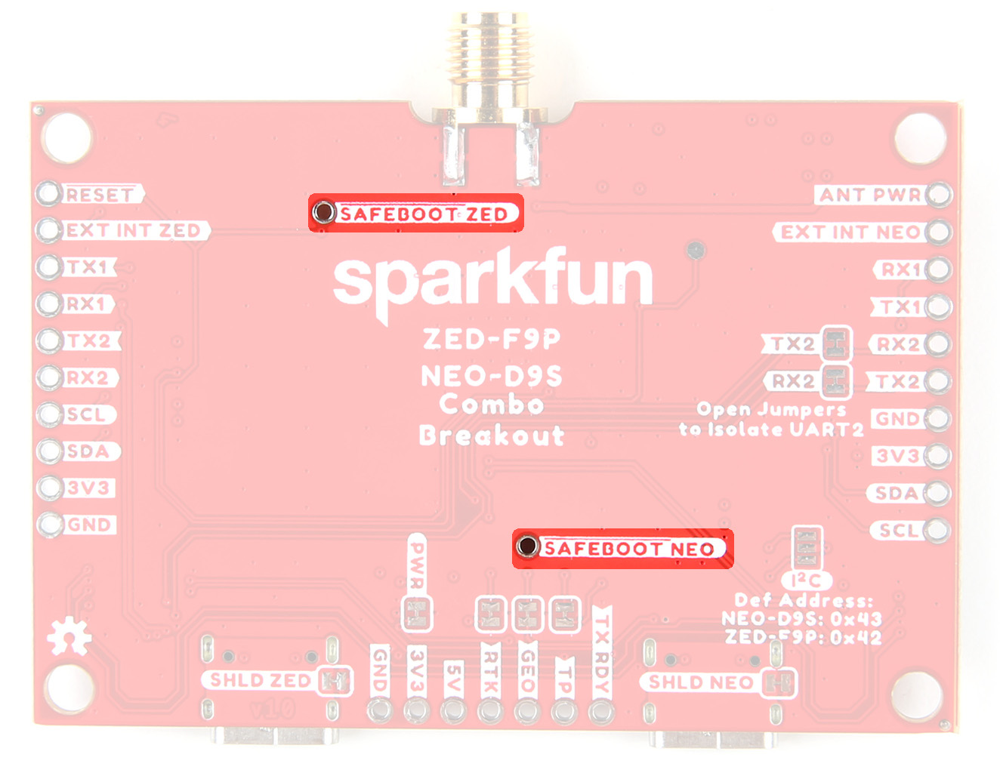{ width="600" }](assets/imgs/22560-SparkFun_u-blox_ZED-F9P_NEO-D9S_Combo-SafeBoot.jpg "Click to enlarge")
<figcaption markdown>
The two SAFEBOOT test points.
</figcaption>
</figure>

## LED Indicators

The breakout has four LED indicators:

* **3V3** Power
* **RTK**: Off = No Carrier Solution; Flashing = Floating Solution; On = Fixed Solution
* **GEO**: Geofence indication
* **TP**: Timing Pulse (Pulse Per Second)

Each LED can be disabled by opening the corresponding split pad jumper on the bottom of the breakout

## Back-up Battery

A small rechargeable coin cell maintains the ZED-F9P battery-backed RAM while the power is disconnected. It maintains the ZED's GNSS Almanac and Real Time Clock.

The battery is recharged slowly whenever 3.3V power is present.

If the battery becomes discharged, connect 3.3V power for at least 48 hours to recharge the battery.

## Power Supply and I/O voltage

Both the ZED-F9P and NEO-D9S are 3.3V devices. They operate from 3.3V and all of their I/O pins are 3.3V.

!!! attention
    Do not drive any of the ZED-F9P or NEO-D9S I/O pins using 5V signals. You may damage either or both modules if you do. Use a suitable level-shifter if you want to interface to a 5V development board.

The board has a 3.3V regulator on-board to regulate 5V USB-C power (if present) down to 3.3V.

The options for providing power to the board are as follows:

* 5V power via one or both USB-C ports
    * Diode protection is provided
* 5V power via the **5V** breakout pin
    * Diode protection prevents the USB-C ports from being reverse-fed
* 3.3V power via:
    * Either of the Qwiic connectors
    * Any of the **3V3** breakout pins

## Current Draw

Worst-case current draw of the ZED-F9P and NEO-D9S combined is 260mA at 3.3V.

Typical current draw of the ZED-F9P and NEO-D9S combined is 100mA.

(These figures exclude any current drawn by an active antenna.)
