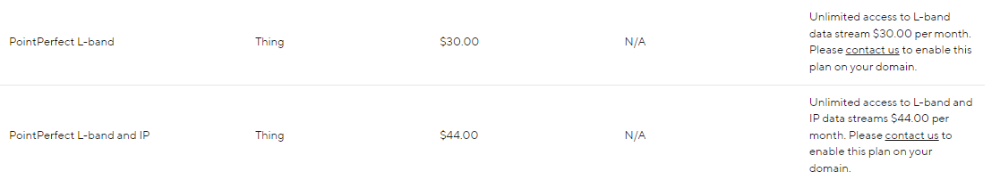

There are three key steps to be able to achieve centimeter positioning accuracy using the ZED-F9P NEO-D9S Combo Breakout:

* Register with u-blox Thingstream and sign up for a PointPerfect L-band plan (data stream)
* Configure the NEO-D9S to receive the u-blox PointPerfect correction data stream
* Configure the ZED-F9P with encryption key(s) so it can decrypt and use the correction data

By default, the Combo Breakout is configured such that the correction data is passed from the NEO to the ZED using the UART2 interface.
However, it is also possible to read the correction data from the NEO and push (write) it to the ZED using I2C.

## Thingstream and PointPerfect

[Thingstream](https://www.u-blox.com/en/product/thingstream) is u-blox service delivery platform for IoT Communication-as-a-Service, IoT Security-as-a-Service and IoT Location-as-a-Service.

[PointPerfect](https://www.u-blox.com/sites/default/files/PointPerfect_ProductSummary_UBX-21024758.pdf) is u-blox GNSS augmentation service which is designed to provide high-precision GNSS corrections to suitable receivers to provide decimeter-level location accuracy.

!!! warning
    u-blox provides products and services to "B2B Customers". Only business customers are eligible to register for a Thingstream (PointPerfect) account. You may be required to demonstrate that the use of the combo breakout is in relation to your trade, business, craft or profession. u-blox products and services are not intended for individual consumer use. Please check the [u-blox Service Terms](https://cdn.sparkfun.com/assets/2/5/a/4/f/Service_Terms.pdf) before purchasing hardware.

PointPerfect data is delivered through Thingstream. The first step is to [register with Thingstream](https://portal.thingstream.io/register) and then request an L-Band plan:

<figure markdown>
[{ width="600" }](assets/imgs/PointPerfect_Pricing.png "Click to enlarge")
<figcaption markdown>
PointPerfect pricing (correct at Sept. 14th 2022).
</figcaption>
</figure>

You can find the current pricing on [u-blox portal](https://portal.thingstream.io/pricing). Select **IoT Location-as-a-Service** and then **PointPerfect**.

You may need to [contact u-blox](mailto:support@thingstream.io) first, to enable the option to purchase an L-Band plan through your Thingstream account.

The **PointPerfect L-band** plan provides unlimited access to the L-band satellite correction data stream (via the NEO-D9S).

If you have an internet connection, you can also receive PointPerfect corrections via IP (MQTT). The **PointPerfect L-band and IP** plan may be a better choice if
you think you may want to receive correction data via both satellite and Internet.

Once L-band permissions are enabled on your Thingstream account, you will be able to add a new L-band Location Thing and view its credentials:

* [Login to Thingstream](https://portal.thingstream.io/)
* Select **Location Services** and then **Location Things**
* The **Add Location Thing** button (top right) will allow you to select and activate an L-Band plan
* Once your L-band plan is active, you will be able to monitor your **Activity** and view your **Credentials** via the appropriate tabs

u-blox have written a [comprehensive application note](https://www.u-blox.com/sites/default/files/documents/NEO-D9S_ZED-F9_Config_SPARTN_AppNote_UBX-22008160.pdf) which
describes in detail: the configuration of both NEO and ZED; and how to interpret the expiry date for the L-band encryption keys. 