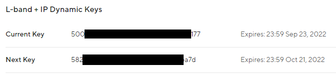
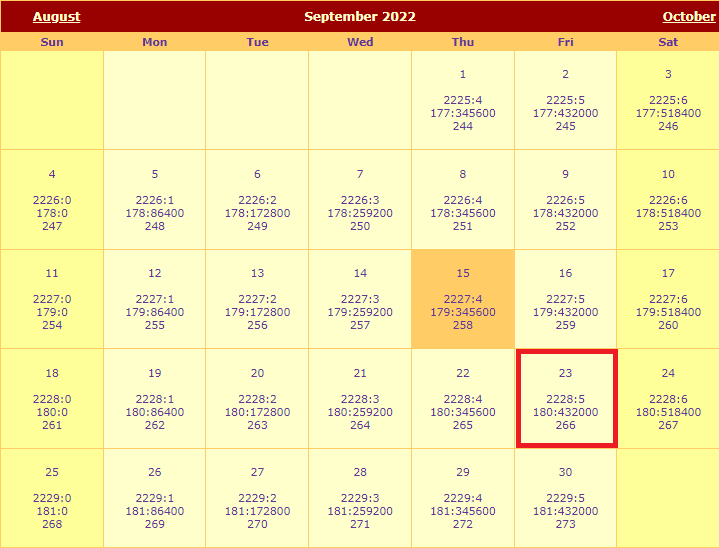
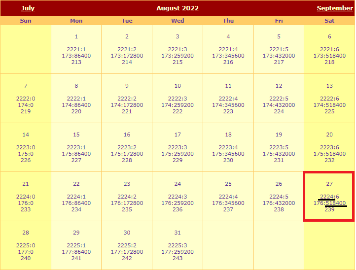

!!! attention
	If this is your first time using Arduino, please review our tutorial on [installing the Arduino IDE](https://learn.sparkfun.com/tutorials/installing-arduino-ide). If you have not previously installed an Arduino library, please check out our [installation guide](https://learn.sparkfun.com/tutorials/installing-an-arduino-library).


SparkFun has an extensive library for its GNSS boards. You can obtain this library through the Arduino Library Manager by searching for "GNSS v3" and installing the latest version. If you prefer downloading libraries manually, you can grab them from the GitHub Repository.

<div class="grid cards desc" markdown>
  <center>
  [u-blox GNSS Arduino Library](https://github.com/sparkfun/SparkFun_u-blox_GNSS_v3/archive/refs/heads/main.zip){ .md-button .md-button--primary }
  </center>
</div>


## NEO-D9S Configuration

The first step is to declare the **`SFE_UBLOX_GNSS`** object. Like most Arduino sketches, this is done at a global scope (after the include file declaration), not within the ```setup()``` or ```loop()``` functions. 

```C++
#include <SparkFun_u-blox_GNSS_v3.h> //http://librarymanager/All#SparkFun_u-blox_GNSS_v3
SFE_UBLOX_GNSS myLBand; // NEO-D9S
```

Within ```setup()``` we then need to start (initialize) communiation with the NEO-D9S.
The NEO-D9S has a default I<sup>2</sup>C address of 0x43 and so we need to provide that when calling the ```begin``` method:

```C++
  Wire.begin(); //Start I2C

  while (myLBand.begin(Wire, 0x43) == false) //Connect to the u-blox NEO-D9S using Wire port. The D9S default I2C address is 0x43 (not 0x42)
  {
    Serial.println(F("u-blox NEO-D9S not detected at default I2C address. Please check wiring."));
    delay(2000);
  }
  Serial.println(F("u-blox NEO-D9S connected"));

```

The NEO-D9S needs to be configured so it can receive the PointPerfect correction stream. The configuration items are: 

| Configuration item | Default value |
| :----------------- | :---- |
| CFG-PMP-CENTER_FREQUENCY | 1539812500 Hz |
| CFG-PMP-SEARCH_WINDOW | 2200 Hz |
| CFG-PMP-USE_SERVICE_ID | 1 (true)|
| CFG-PMP-SERVICE_ID | 50821 |
| CFG-PMP-DATA_RATE | 2400 (B2400) bps |
| CFG-PMP-USE_DESCRAMBLER | 1 (true) |
| CFG-PMP-DESCRAMBLER_INIT | 23560 |
| CFG-PMP-USE_PRESCRAMBLING | 0 (false) |
| CFG-PMP-UNIQUE_WORD | 0xe15ae893e15ae893 |

The centre frequency varies depending on which satellite is broadcasting corrections for your geographical area.

The up-to-date frequencies are distributed via the MQTT **/pp/frequencies/Lb** topic. At the time of writing, they are (in MHz):

```C++
{
  "frequencies": {
    "us": {
      "current": {
        "value": "1556.29"
      }
    }
  }
}
```

We can add that to the code as follows:

```C++
const uint32_t myLBandFreq = 1556290000; // Uncomment this line to use the US SPARTN 1.8 service
```

The code to configure the NEO-D9S is as follows. Note that the **`UBLOX_CFG_PMP_USE_SERVICE_ID`**, **`UBLOX_CFG_PMP_SERVICE_ID`** and **`UBLOX_CFG_PMP_DESCRAMBLER_INIT`**
also need to be changed.

```C++
  uint8_t ok = myLBand.setVal(UBLOX_CFG_PMP_CENTER_FREQUENCY,  myLBandFreq); // Default 1539812500 Hz
  if (ok) ok = myLBand.setVal(UBLOX_CFG_PMP_SEARCH_WINDOW,     2200);        // Default 2200 Hz
  if (ok) ok = myLBand.setVal(UBLOX_CFG_PMP_USE_SERVICE_ID,    0);           // Default 1 
  if (ok) ok = myLBand.setVal(UBLOX_CFG_PMP_SERVICE_ID,        21845);       // Default 50821
  if (ok) ok = myLBand.setVal(UBLOX_CFG_PMP_DATA_RATE,         2400);        // Default 2400 bps
  if (ok) ok = myLBand.setVal(UBLOX_CFG_PMP_USE_DESCRAMBLER,   1);           // Default 1
  if (ok) ok = myLBand.setVal(UBLOX_CFG_PMP_DESCRAMBLER_INIT,  26969);       // Default 23560
  if (ok) ok = myLBand.setVal(UBLOX_CFG_PMP_USE_PRESCRAMBLING, 0);           // Default 0
  if (ok) ok = myLBand.setVal(UBLOX_CFG_PMP_UNIQUE_WORD,       16238547128276412563ull); // 0xE15AE893E15AE893
```

Finally, we need to ensure that the UART2 port is set correctly. We need to:

* Change the baud rate to 38400 - to match the ZED-F9P's baud rate
* Ensure that the **UBX** protocol is enabled for output on UART2
* Enable the **RXM PMP** message on UART2
    * The **RXM PMP** message contains the **SPARTN** correction data in **UBX** format
* Perform a restart (software reset) so that the NEO-D9S starts using the new configuration items

```C++
  if (ok) ok = myLBand.setVal(UBLOX_CFG_UART2_BAUDRATE,           38400); // match baudrate with ZED default
  if (ok) ok = myLBand.setVal(UBLOX_CFG_UART2OUTPROT_UBX,         1);     // Enable UBX output on UART2
  if (ok) ok = myLBand.setVal(UBLOX_CFG_MSGOUT_UBX_RXM_PMP_UART2, 1);     // Output UBX-RXM-PMP on UART2
  
  Serial.print(F("L-Band configuration: "));
  if (ok)
    Serial.println(F("OK"));
  else
    Serial.println(F("NOT OK!"));

  myLBand.softwareResetGNSSOnly(); // Do a restart
```

Once the NEO-D9S has aquired the signal from the satellite, it will start outputting **PMP** correction messages to the ZED-F9P on UART2.

## ZED-F9P Configuration

We need to declare a second **`SFE_UBLOX_GNSS`** object for the ZED-F9P. Again, this is done at a global scope (after the include file declaration), not within the ```setup()``` or ```loop()``` functions. 

```C++
SFE_UBLOX_GNSS myGNSS; // ZED-F9P
```

Within ```setup()``` we need to start (initialize) communiation with the ZED-F9P:

```C++
  while (myGNSS.begin() == false) //Connect to the u-blox module using Wire port and the default I2C address (0x42)
  {
    Serial.println(F("u-blox GNSS module not detected at default I2C address. Please check wiring."));
    delay(2000);
  }
  Serial.println(F("u-blox GNSS module connected"));
```

We then need to:

* Make sure the ZED-F9P's UART2 port is configured to accept the PMP correction data
* Tell the ZED-F9P to use FIXED carrier solutions when possible (this is the default setting)
* Tell the ZED-F9P to accept L-band PMP as a correction source

```C++
          ok = myGNSS.setI2CInput(COM_TYPE_UBX | COM_TYPE_NMEA | COM_TYPE_SPARTN); //Be sure SPARTN input is enabled
  if (ok) ok = myGNSS.setDGNSSConfiguration(SFE_UBLOX_DGNSS_MODE_FIXED); // Set the differential mode - ambiguities are fixed whenever possible
  if (ok) ok = myGNSS.setVal8(UBLOX_CFG_SPARTN_USE_SOURCE, 1); // use LBAND PMP message
```

The final piece of the puzzle is to provide the ZED-F9P with the keys it needs to decrypt the encrypted SPARTN (PMP) corrections.

The ZED-F9P can hold two dynamic keys: the current key; and the next key. We also need to tell it when each key is valid from, so it knows when to switch to the next key.

You can find the current and next keys in the **`Location Services \ Location Things \ Thing Details \ Credentials`** tab in Thingstream:

<figure markdown>
[{ width="600" }](assets/imgs/Dynamic_Keys.png "Click to enlarge")
<figcaption markdown>
PointPerfect L-band dynamic keys.
</figcaption>
</figure>

The ZED-F9P actually needs to know when the keys are valid **from**, rather than when they expire. Each key is walid for four weeks, so we need to work backwards 4 weeks from the expiry date.

The current key expires at midnight (UTC) at the end of Friday September 23rd. This means it became valid 4 weeks earlier at midnight (UTC) on August 27th:

<figure markdown>
[{ width="200" }](assets/imgs/Key_Expiry.png "Click to enlarge")
<figcaption markdown>
Dynamic Key expiry.
</figcaption>
</figure>

<figure markdown>
[{ width="200" }](assets/imgs/Key_Valid_From.png "Click to enlarge")
<figcaption markdown>
Dynamic Key: Expiry and Valid From dates.
</figcaption>
</figure>

Using the website recommended in the u-blox Application Note:

**http://navigationservices.agi.com/GNSSWeb**

we can see that the key became valid during GPS week **2224**, at time-of-week **518400**.

We can use the Arduino Library **`setDynamicSPARTNKey`** method to configure a single key:

```C++
  if (ok) ok = myGNSS.setDynamicSPARTNKey(16, 2224, 518400, "500--------------------------177");

  Serial.print(F("GNSS: configuration "));
  if (ok)
    Serial.println(F("OK"));
  else
    Serial.println(F("NOT OK!"));
```

Alternately, we can set both the current key and the next key together using **`setDynamicSPARTNKeys`**. The next key becomes valid during GPS week **2228**:

```C++
  if (ok) ok = myGNSS.setDynamicSPARTNKeys(16, 2224, 518400, "500--------------------------177", 16, 2228, 518400, "582--------------------------a7d");
```

The keys can also be retrieved using MQTT. We have an [Arduino Library example](https://github.com/sparkfun/SparkFun_u-blox_GNSS_v3/tree/main/examples/NEO-D9S_and_NEO-D9C/Example6_PMP_with_L-Band_Keys_via_MQTT)
which shows how to retrieve the keys from the L-band + IP key distribution topic **/pp/ubx/0236/Lb** . That topic provides the keys in UBX (binary) format, ready to be pushed to the ZED.

The keys are also available in human-readable JSON format from the MQTT topic **/pp/key/Lb** . But note that that topic provides the **valid from** in Unix epoch format,
in milliseconds, excluding the 18 leap seconds since GPS time started!

```C++
{
  "dynamickeys": {
    "current": {
      "start": "1661558382000",
      "duration": "2419199999",
      "value": "500--------------------------177"
    },
    "next": {
      "start": "1663977582000",
      "duration": "2419199999",
      "value": "582--------------------------a7d"
    }
  }
}
```
