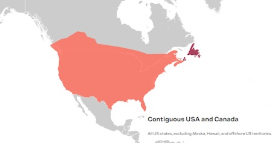

!!! note
    
        <strong> Not working as expected and need help? </strong>   

    If you need technical assistance and more information on a product that is not working as you expected, we recommend heading on over to the <a href="https://www.sparkfun.com/technical_assistance">SparkFun Technical Assistance</a> page for some initial troubleshooting.   

    
<a href="https://www.sparkfun.com/technical_assistance" target="sfe_technical_assistance" class="md-button">SparkFun Technical Assistance Page</a>

    If you don't find what you need there, the <a href="https://forum.sparkfun.com/index.php">SparkFun Forums</a> are a great place to find and ask for help. Make sure you check out the <a href="https://forum.sparkfun.com/viewforum.php?f=116">GPS Forums</a>. 
    
    Note that if this is your first visit to the forums, you'll need to <a href="https://forum.sparkfun.com/ucp.php?mode=register">create a Forum Account</a> to search product forums and post questions.  

    
<a href="https://forum.sparkfun.com/ucp.php?mode=register" class="md-button">Create New Forum Account</a>&nbsp;&nbsp;&nbsp;<a href="https://forum.sparkfun.com/index.php" class="md-button md-button--primary">Log Into SparkFun Forums</a>

## Tips and Tricks

!!! attention
    u-blox provides products and services to "B2B Customers". Only business customers are eligible to register for a Thingstream (PointPerfect) account. You may be required to demonstrate that the use of the combo breakout is in relation to your trade, business, craft or profession. u-blox products and services are not intended for individual consumer use.

## PointPerfect L-band Reception

In order to receive the u-blox PointPerfect correction data, you will: need a suitable antenna; need to be located within contiguous USA; and have a clear view of the sky to the South.

### SparkFun GNSS Multi-Band L1/L2 Surveying Antenna - TOP106

We have been successful using the [SparkFun GNSS Multi-Band L1/L2 Surveying Antenna (TNC) - TOP106 (GPS-17751)](https://www.sparkfun.com/products/17751) antenna to receive
PointPerfect correction data in the USA.

### PointPerfect Coverage

The PointPerfect GNSS augmentation service is available on a continental scale with seamless coverage in the contiguous USA, including up to 12 nautical miles  (~ 22 km) off coastlines.

<figure markdown>
[{ width="200" }](assets/imgs/pointperfect_coverage.jpg "Click to enlarge")
<figcaption markdown>
PointPerfect Service Coverage.
</figcaption>
</figure>

### PointPerfect Satellite Broadcast

PointPerfect augmentation data is broadcast from a satellite covering the contiguous USA. The satellite is in geostationary orbits over the equator - the same as for satellite television broadcasts. It is essential that your antenna has an unobstructed view of the sky, especially to the South where the satellite is positioned.

Depending on your latitude, the satellite for your area could be low in the sky. You need to ensure that trees, buildings etc. are not blocking the signal.

## Don't see what you need?
The use cases for this Combo Board are too numerous and complex to cover all potential issues. If you are having issues that we haven't covered here, please refer to the <a href="https://forum.sparkfun.com/index.php">SparkFun Forums</a> for help. If this is your first visit, you'll need to <a href="https://forum.sparkfun.com/ucp.php?mode=register">create a Forum Account</a> to search product forums and post questions.  

<a href="https://forum.sparkfun.com/ucp.php?mode=register" class="md-button">Create New Forum Account</a>&nbsp;&nbsp;&nbsp;<a href="https://forum.sparkfun.com/index.php" class="md-button md-button--primary">Log Into SparkFun Forums</a> 
